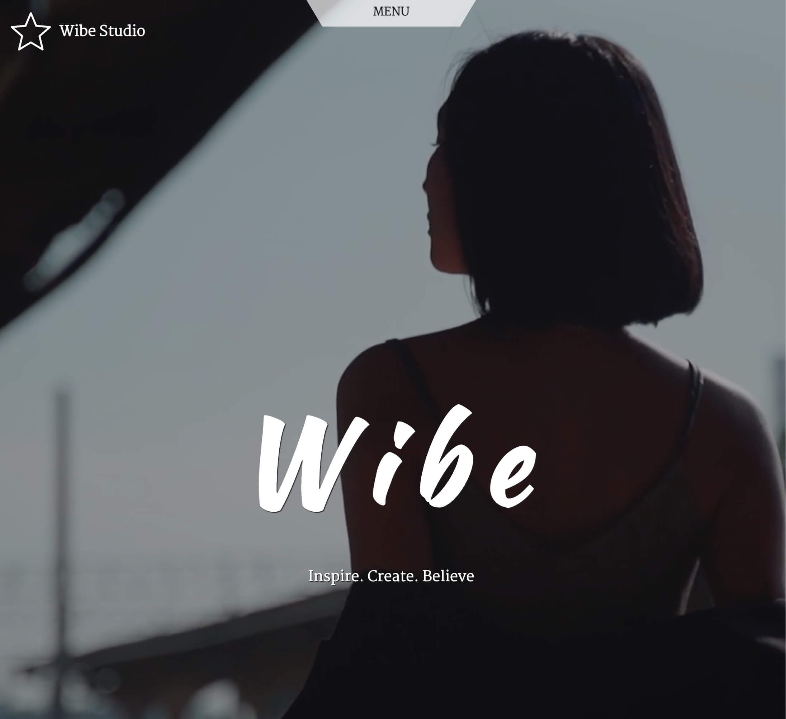

# Wibe Studio

This React project serves as a proof of concept and a means for me to acquire new skills. It's a single landing page that features generic visuals and fictitious text about a made-up fashion brand as its sole content. It heavily utilizes animation and is purely front-end with no backend involvement. The two animation libraries that bring the page to life are GSAP and Framer Motion. To incorporate scroll based animation I went for the industry standard GSAP ScrollTrigger, while Framer Motion handles all other stuff such as simple transitions and morphing effects. The main challenge was to seamlessly integrate both libraries and make them work together nicely. Having said that, the whole thing is not intended to be comprehensive or exhaustive. In fact it's quite rough arround the edges and is not optimized for mobile. That was not my primary goal, my goal was just to familiarize myself with web animation and get a grasp on the concept.
